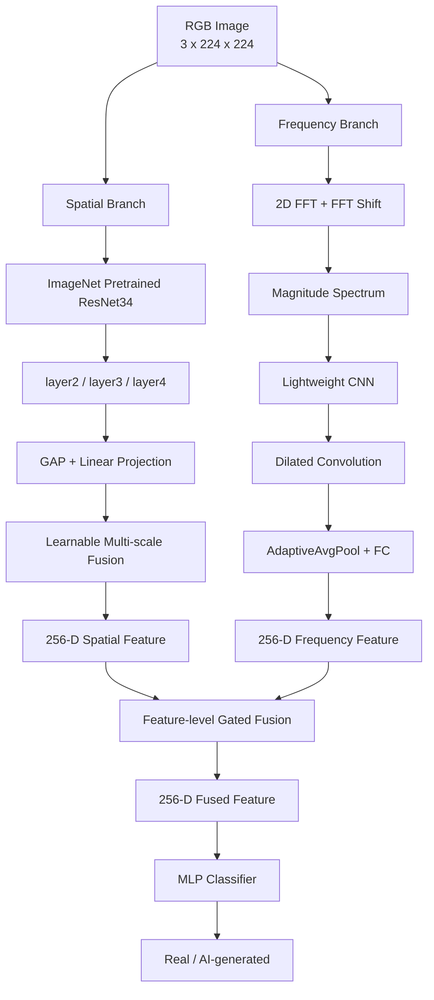

# AI Image Detector — AI 生成图像检测系统

基于 **空间域 + 频域双分支神经网络** 的 AI 生成图像检测项目，用于区分真实图像（Real）与 AI 生成图像（AI-generated）。

模型以 **ResNet34 多尺度空间特征**为主干，同时通过 **2D FFT 幅值谱 + 轻量 CNN + Dilated CNN** 建模频域信息，并利用 **Feature-level Gated Fusion** 对空间与频域特征进行逐维融合。

在 CIFAKE 数据集统一 `seed=42`、固定 8:2 数据划分下，完整模型在 **20,000 张验证图像**上达到：

* **Accuracy：97.42%**
* **Precision：96.88%**
* **Recall：98.01%**
* **F1 Score：97.44%**

---

## Highlights

* **Spatial-Frequency Dual Branch**：联合建模空间纹理与频谱信息
* **Multi-scale ResNet34**：融合 `layer2 / layer3 / layer4` 多尺度特征
* **FFT Frequency Branch**：基于 2D FFT 幅值谱与轻量卷积网络提取频域表征
* **Dilated CNN**：在不显著增加参数量的情况下扩大频域感受野
* **Feature-level Gating**：为不同特征维度自适应分配空间域与频域信息权重
* **Transfer Learning**：空间分支采用 ImageNet 预训练 ResNet34
* **AMP Training**：基于 `autocast + GradScaler` 实现混合精度训练
* **Training Pipeline**：支持数据增强、学习率调度、Early Stopping、Checkpoint 与断点续训
* **Single-image Inference**：支持单张图像分类与预测置信度输出

---

## Network Architecture



---

## Model Design

### 1. Spatial Branch

空间分支使用 **ImageNet 预训练 ResNet34** 作为 Backbone。

为了同时获取不同尺度的图像信息，从以下三个阶段提取特征：

* `layer2`：中尺度局部纹理
* `layer3`：中高层视觉表征
* `layer4`：高层语义与全局结构

不同尺度特征分别经过 Global Average Pooling 和线性映射统一至 256 维，并通过可学习 Softmax 权重完成多尺度融合。

```text
RGB Image
    │
    ▼
ResNet34
    │
    ├── layer2 ── GAP ── Linear ──┐
    │                              │
    ├── layer3 ── GAP ── Linear ──┼── Learnable Weighted Fusion
    │                              │
    └── layer4 ── GAP ── Linear ──┘
                                   │
                                   ▼
                         256-D Spatial Feature
```

---

### 2. Frequency Branch

频域分支首先对输入 RGB 图像进行二维快速傅里叶变换：

```text
RGB
 │
 ▼
2D FFT
 │
 ▼
FFT Shift
 │
 ▼
Magnitude Spectrum
 │
 ▼
Lightweight CNN
 │
 ▼
Dilated Convolution
 │
 ▼
256-D Frequency Feature
```

频域变换作为固定图像变换过程，后续使用轻量 CNN 从头学习频谱特征。

核心结构包括：

```text
Conv 3 → 64
BatchNorm
ReLU
MaxPool

Conv 64 → 128
BatchNorm
ReLU
MaxPool

Conv 128 → 256
BatchNorm
ReLU
MaxPool

Dilated Conv
AdaptiveAvgPool
Linear 256 → 256
```

其中空洞卷积用于扩大频域特征的有效感受野，以建模更大范围的频谱分布模式。

---

### 3. Feature-level Gated Fusion

两个分支最终均输出 256 维特征：

```text
Spatial Feature   : 256-D
Frequency Feature : 256-D
```

首先进行特征拼接：

```text
256 + 256 → 512-D
```

随后使用门控网络生成空间分支和频域分支对应的逐维融合权重：

```text
Concat(Spatial, Frequency)
        │
        ▼
Linear 512 → 256
        │
       ReLU
        │
        ▼
Linear 256 → 512
        │
      Sigmoid
        │
        ▼
Split
  │             │
  ▼             ▼
w_spatial    w_frequency
```

最终融合：

```text
Fused Feature
=
Spatial × w_spatial
+
Frequency × w_frequency
```

相比直接拼接，Feature-level Gating 可以针对不同特征维度动态调整两类信息的融合比例。

---

### 4. Classifier

融合后的 256 维特征输入 MLP 分类器：

```text
256
 │
 ▼
Linear 256 → 128
 │
ReLU
 │
Dropout
 │
Linear 128 → 2
 │
 ▼
Real / AI-generated
```

训练使用 Cross Entropy Loss 完成二分类优化。

---

## Dataset

本项目使用 **CIFAKE** 数据集。

### Dataset Statistics

| 项目           |      数值 |
| ------------ | ------: |
| 总图像数量        | 100,000 |
| Real         |  50,000 |
| AI-generated |  50,000 |
| 原始分辨率        | 32 × 32 |
| 训练集          |  80,000 |
| 验证集          |  20,000 |
| 数据划分         |   8 : 2 |
| Random Seed  |      42 |

数据集类别均衡，真实图像与 AI 生成图像各占 50%。

### Directory Structure

下载数据集后整理为：

```text
data/
├── real/
│   ├── 0001.jpg
│   ├── 0002.jpg
│   └── ...
│
└── fake/
    ├── 0001.jpg
    ├── 0002.jpg
    └── ...
```

> CIFAKE 原始目录通常为 `REAL/` 与 `FAKE/`，可根据项目代码调整目录名称。

---

## Data Augmentation

训练阶段采用数据增强降低过拟合风险，包括：

* Resize：`32 × 32 → 224 × 224`
* Random Horizontal Flip
* Random Rotation
* Color Jitter
* Random Affine
* Random Erasing
* ImageNet Normalize

验证阶段仅进行：

```text
Resize
→ ToTensor
→ Normalize
```

不使用随机数据增强。

---

## Experimental Results

在统一：

```text
seed = 42
train / validation = 8 : 2
validation samples = 20,000
```

条件下，Full Model 的验证集结果如下：

| Metric        |     Result |
| ------------- | ---------: |
| **Accuracy**  | **97.42%** |
| **Precision** | **96.88%** |
| **Recall**    | **98.01%** |
| **F1 Score**  | **97.44%** |

完整模型训练 20 Epoch。

---

## Engineering Optimization

### 1. AMP Mixed Precision Training

项目使用：

```python
autocast
GradScaler
```

构建 AMP 混合精度训练流水线。

其中：

* 适合 FP16 的卷积与矩阵运算使用低精度计算
* `GradScaler` 对 Loss 进行动态缩放，降低 FP16 小梯度下溢风险
* 参数更新仍保持必要的数值稳定性

实测结果：

| Setting | Step Time |
| ------- | --------: |
| FP32    |   49.4 ms |
| AMP     |   39.4 ms |

训练吞吐提升约：

```text
1.25×
```

配合学习率调度与 Early Stopping，完整 20 Epoch 训练约 **1 小时**完成。

---

### 2. Learning Rate Scheduler

采用自适应学习率调度策略。

当验证集指标长期未提升时自动降低学习率，使模型在训练后期能够进行更细粒度优化。

---

### 3. Early Stopping

当验证集性能连续多轮没有提升时提前终止训练，避免：

* 无效训练
* 过拟合
* GPU 计算资源浪费

---

### 4. Checkpoint & Resume

训练过程中自动保存：

* 当前 Epoch
* 模型参数
* Optimizer 状态
* Learning Rate Scheduler 状态
* 最佳验证指标

训练中断后可通过：

```bash
python train.py --resume
```

继续训练，无需重新开始。

---

## Project Structure

```text
ai-image-detector/
├── configs/
│   └── config.yaml
│
├── data/
│   ├── real/
│   └── fake/
│
├── models/
│   ├── spatial_branch.py
│   ├── frequency_branch.py
│   ├── fusion.py
│   └── classifier.py
│
├── utils/
│   ├── metrics.py
│   ├── logger.py
│   └── fft_utils.py
│
├── checkpoints/
│   ├── best.pth
│   └── checkpoint_last.pth
│
├── model.py
├── train.py
├── eval.py
├── infer.py
│
├── requirements.txt
├── .gitignore
└── README.md
```

建议不要将数据集及全部 Epoch 权重直接提交到 Git 仓库。

例如：

```gitignore
data/
checkpoints/*.pth
logs/
__pycache__/
*.pyc
```

如需公开最佳模型权重，可以通过 GitHub Releases 或 Git LFS 单独管理。

---

## Environment

推荐使用 Conda 创建独立 Python 环境。

### Conda

```bash
conda create -n ai-image-detector python=3.10
conda activate ai-image-detector
```

安装 PyTorch：

```bash
conda install pytorch torchvision pytorch-cuda=12.1 -c pytorch -c nvidia
```

安装其他依赖：

```bash
pip install -r requirements.txt
```

---

## Dependencies

```text
torch >= 1.10.0
torchvision >= 0.11.0
pillow >= 9.0.0
pyyaml >= 5.0
```

> PyTorch / CUDA 版本请根据本机 GPU 与 CUDA Driver 环境进行调整。

---

## Configuration

主要训练参数位于：

```text
configs/config.yaml
```

示例：

```yaml
seed: 42

data:
  batch_size: 32
  num_workers: 2
  train_ratio: 0.8

training:
  epochs: 20
  lr: 0.0003
  early_stop_patience: 5
```

为保证实验可复现，建议固定：

```yaml
seed: 42
```

并在数据集划分、模型初始化及 DataLoader 等随机过程统一设置随机种子。

---

## Training

### Train from Scratch

```bash
conda activate ai-image-detector
python train.py
```

训练过程将自动执行：

```text
Dataset Loading
      ↓
Train / Validation Split
      ↓
Data Augmentation
      ↓
Forward
      ↓
Loss Calculation
      ↓
AMP Backward
      ↓
Optimizer Update
      ↓
Validation
      ↓
Checkpoint
      ↓
LR Scheduler / Early Stopping
```

训练过程中记录：

* Train Loss
* Validation Loss
* Accuracy
* Precision
* Recall
* F1 Score
* Learning Rate
* Best Checkpoint

---

### Resume Training

如果训练中断：

```bash
python train.py --resume
```

程序将从最近一次 Checkpoint 恢复：

* Epoch
* Model
* Optimizer
* Scheduler

并继续训练。

---

## Evaluation

使用最佳模型在验证集上进行评估：

```bash
python eval.py
```

示例输出：

```text
Device: cuda
Validation samples: 20000

Loaded checkpoint:
checkpoints/best.pth

Evaluation Results
------------------
Accuracy : 97.42%
Precision: 96.88%
Recall   : 98.01%
F1 Score : 97.44%
```

---

## Inference

### Single-image Inference

基本用法：

```bash
python infer.py path/to/image.jpg --ckpt checkpoints/best.pth
```

例如：

```bash
python infer.py data/test.jpg --ckpt checkpoints/best.pth
```

输出：

```text
Loaded checkpoint: checkpoints/best.pth

Result:
AI-generated

Confidence:
0.9987
```

预测类别：

* `Real`：真实图像
* `AI-generated`：AI 生成图像
* `confidence`：模型对当前预测类别的 Softmax 置信度

---

### Specify Device

GPU：

```bash
python infer.py path/to/image.jpg \
    --ckpt checkpoints/best.pth \
    --device cuda
```

CPU：

```bash
python infer.py path/to/image.jpg \
    --ckpt checkpoints/best.pth \
    --device cpu
```

自动选择设备：

```bash
python infer.py path/to/image.jpg \
    --ckpt checkpoints/best.pth \
    --device auto
```

---

## Limitations

当前项目主要基于 **CIFAKE 32 × 32 图像**完成训练与同分布验证。

虽然模型在 CIFAKE 验证集上取得较高分类准确率，但当前实验仍存在以下限制：

1. **分辨率差异**

   CIFAKE 原始图像仅为 `32 × 32`，与真实互联网场景中的高清图像存在明显分布差异。

2. **跨生成器泛化尚未系统验证**

   当前结果主要反映模型在 CIFAKE 数据分布下的检测能力，尚不能直接代表对其他生成模型图像的通用检测能力。

3. **频域信息目前仅使用 FFT 幅值谱**

   当前频域输入主要基于 Magnitude Spectrum，尚未进一步融合相位谱等频域信息。

4. **真实场景鲁棒性仍需验证**

   JPEG 压缩、Resize、截图、二次编辑等操作可能改变图像统计特征，需要进一步进行鲁棒性测试。

---

## Future Work

后续可进一步研究：

* 不同生成模型之间的 Cross-generator Generalization
* 高清真实图像与 AI 生成图像检测
* FFT Magnitude + Phase 联合频域建模
* JPEG / Resize / Blur 等退化条件下的鲁棒性
* 更高效的空间-频域特征融合机制
* Transformer / ViT 等视觉结构在 AI 图像检测中的应用

---

## Reproducibility

为了保证实验结果具有可复现性，本项目建议固定：

```text
Random Seed = 42
```

并保持以下设置一致：

* 数据集版本
* Train / Validation Split
* 数据增强配置
* Batch Size
* Learning Rate
* Optimizer
* Model Configuration
* Evaluation Script

本 README 中报告的主要实验结果均基于统一数据划分进行统计。

---

## Notes

本项目主要用于深度学习与 AI 图像检测相关的学习、研究和实验验证。

当前实验结果应理解为模型在 **CIFAKE 数据分布下**的表现，不代表模型已经能够可靠识别所有真实互联网场景中的 AI 生成图像。
